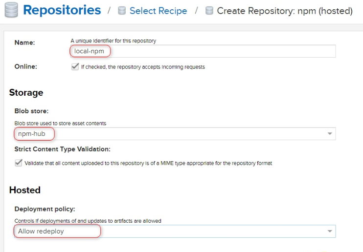

# nexus-create
# 一、搭建Maven仓库

## 1.1开启root用户运行nexus

vim etc/profile 在该文件最下方 加入:

export RUN_AS_USER=root

## 1.2运行

进入到bin目录，执行： ./nexus start

## 1.3设置开机启动

创建连接到 /etc/init.d下

```
sudo ln -s /usr/local/nexus-2.11.2-03/bin/nexus /etc/init.d/nexus
```

查看nexus服务状态、启动服务、停止服务等

```
service nexus status/start/stop
```

设置nexus服务开机自启动或者开机不启动

```
chkconfig nexus on/off
```

#### systemctl start nexus出现异常，可使用如下解决方案：

这个问题很简单，只需要修改一下 nexus 的配置文件就可以了，根据错误提示内容，在配置文件中找到 “ INSTALL4J_JAVA_HOME_OVERRIDE ” 项，取消其注解，并将地址指向本地的 Jre 环境即可

## 1.4调整配置

下载解压文件后：配置bin目录下nexus.vmoptions文件，适当调整内存参数，防止占用内存太大


## 1.5添加代理

1. aliyun
http://maven.aliyun.com/nexus/content/groups/public
2. apache_snapshot
https://repository.apache.org/content/repositories/snapshots/
3. apache_release
https://repository.apache.org/content/repositories/releases/
4. atlassian
https://maven.atlassian.com/content/repositories/atlassian-public/
5. central.maven.org
http://central.maven.org/maven2/
6. datanucleus
http://www.datanucleus.org/downloads/maven2
7. maven-central （安装后自带，仅需设置Cache有效期即可）
https://repo1.maven.org/maven2/
8. nexus.axiomalaska.com
http://nexus.axiomalaska.com/nexus/content/repositories/public
9. oss.sonatype.org
https://oss.sonatype.org/content/repositories/snapshots
10.pentaho
https://public.nexus.pentaho.org/content/groups/omni/

####  设置maven-public 将这些代理加入Group，最好将默认的maven库放到最底下


# 二、搭建npm仓库

## 2.1创建blob存储。

为其创建一个单独的存储空间。


## 2.2创建hosted类型的npm。

- `Name`: 定义一个名称local-npm
- `Storage`：Blob store，我们下拉选择前面创建好的专用blob：npm-hub。
- `Hosted`：开发环境，我们运行重复发布，因此Delpoyment policy 我们选择Allow redeploy。这个很重要！



## 2.3创建一个proxy类型的npm仓库。

- `Name`: proxy-npm
- `Proxy`：Remote Storage: 远程仓库地址，
- 这里填写:1. [https://registry.npmjs.org](http://www.eryajf.net/go?url=https://registry.npmjs.org) 2. https://registry.npm.taobao.org
- `Storage`: npm-hub。

其他的均是默认。

整体配置截图如下：


## 2.4创建一个group类型的npm仓库。

- `Name`：group-npm
- `Storage`：选择专用的blob存储npm-hub。
- `group` : 将左边可选的2个仓库，添加到右边的members下。

整体配置截图如下：


这些配置完成之后，就可以使用了。

## 2.5验证使用。

新建一台环境干净的主机，安装好node环境。

### 2.5.1首先获取默认的仓库地址：

1. npm config get registry

### 2.5.2配置为私服地址。

从如下截图中查看(其实就是创建的组对外的地址)。


通过如下命令配置：

1. npm config set registry http://192.168.4.188:8081/repository/npm-group/
2. npm config get registry
3. http://192.168.31.134:8081/repository/group-npm/

现在开始安装，安装之前先看一下组里的内容：


可以看到还是空的。

### 2.5.3安装编译。

1. npm install

在编译的过程中，我们已经可以看看组里的变化了：


安装完成，整个过程如下，可以看到一共花费了`82秒`。

1. npm install

# 三、安装easy-mock

## 3.1安装Node

### 3.1.1下载

```
# cd /usr/huahe/                # 任何目录都行，先mkdir创建好目录，然后切换过去
# yum install -y wget
# wget https://npm.taobao.org/mirrors/node/v8.10.0/node-v8.10.0-linux-x64.tar.xz
# xz -d node-v8.10.0-linux-x64.tar.xz
# tar -xvf node-v8.10.0-linux-x64.tar
# vi /etc/profile              # 修改环境变量
```

#### 3.1.2修改环境变量

```
export NODE_HOME=/usr/huahe/node-v8.10.0-linux-x64
export PATH=${PATH}:$NODE_HOME/bin

# source /etc/profile         # 使新配置的环境变量生效
# node -v                     # 测试Node是否配置完成，如果出现版本号说明成功了
```

## 3.2安装redis

### 3.2.1下载

```
# wget http://download.redis.io/releases/redis-4.0.14.tar.gz
# tar xvzf redis-stable.tar.gz
# cd redis-4.0.14/
# yum -y install gcc          # 编译需要先安装gcc
# make                        # 如报错可使用命令 # make MALLOC=libc
# cp src/redis-server /usr/local/bin/
# cp src/redis-cli /usr/local/bin/
# vi redis.conf 修改daemonize=no为yes，保存
# redis-server redis.conf     # 此时redis已经在后台运行

```

### 3.2.2设置外网可以访问

前提是你已经把redis的端口放到了防火墙计划中,

```
/sbin/iptables -I INPUT -p tcp --dport 6379 -j ACCEPT
/etc/rc.d/init.d/iptables save
```

 更改redis.conf 文件：/etc/redis/

```
bind 127.0.0.1` 
`protected-mode ``yes
```

 更改为

```
# bind 127.0.0.1` 
`protected-mode no
```

 然后重启redis
关闭redis

```
# redis-cli shutdown
重启redis
```

```
redis-server /opt/local/redis/redis-4.0.6/redis.conf
```

 redis-server 同样也是安装路径下的. 

### 3.2.3设置密码

设置redis.config下

```
requirepass foobared 去掉行前的注释，并修改密码为所需要的密码。保存文件
```

### 3.3.3设置开机启动

1.修改redis.conf文件，把daemonize no改成daemonize yes

2.设置开机启动

```
vi /etc/init.d/redis  --创建脚本文件
```

```
#!/bin/bash
#chkconfig: 22345 10 90
#description: Start and Stop redis

REDISPORT=8530
EXEC=/usr/local/redis-3.0.3/src/redis-server
CLIEXEC=/usr/local/redis-3.0.3/src/redis-cli

PIDFILE=/var/run/redis_6379.pid
CONF="/usr/local/redis-4.0.14/redis.conf"

case "$1" in
    start)
        if [ -f $PIDFILE ];then
            echo "$PIDFILE exists,process is already running or crashed"
        else
            echo "Starting Redis server..."
            $EXEC $CONF
        fi
        ;;
    stop)
        if [ ! -f $PIDFILE ];then
            echo "$PIDFILE does not exist,process is not running"
        else
            PID=$(cat $PIDFILE)
            echo "Stopping..."
            $CLIEXEC -p $REDISPORT shutdown
            while [ -x /proc/${PID} ]
                do
                    echo "Waiting for Redis to shutdown..."
                    sleep 1
                done
                echo "Redis stopped"
        fi
        ;;
    restart)
        "$0" stop
        sleep 3
        "$0" start
        ;;
    *)
        echo "Please use start or stop or restart as first argument"
        ;;
esac
```

3、写完记得修改文件权限

\#chmod +x /etc/init.d/redis

4、把脚本添加到系统服务列表

```
#chkconfig --add redis
#chkconfig redis on
#chkconfig --list   //查看所有注册的脚本文件
```

## 3.3安装MongoDB

### 3.3.1下载

```
# wget https://fastdl.mongodb.org/linux/mongodb-linux-x86_64-3.6.13.tgz --no-check-certificate
# tar zxvf mongodb-linux-x86_64-3.6.13.tgz
# vi /etc/profile
# source /etc/profile            # 使新配置的环境变量生效
```

### 3.3.2环境变量配置

```
export MONGODB_HOME=/usr/huahe/mongodb-linux-x86_64-3.6.13
export PATH=${PATH}:$NODE_HOME/bin:$MONGODB_HOME/bin

# mkdir -p /usr/local/mongodb/data        # 创建数据库目录以及日志目录
# mkdir -p /usr/local/mongodb/logs        # 创建数据库目录以及日志目录
# cd /usr/local/mongodb/
# vi mongo.conf                           # 内容如下，修改后保存

```

### 3.3.3修改配置

```
dbpath=/usr/local/mongodb/data
logpath=/usr/local/mongodb/logs/mongo.log #事先创建该文件
logappend=true
journal=true
quiet=true
port=27017
fork=true #后台运行
```

### 3.3.4启动运行

```
# cd /usr/huahe/mongodb-linux-x86_64-3.6.13/
# bin/mongod -f /usr/local/mongodb/mongo.conf    # 启动mongodb，此时mongodb已在后台运行
```

### 3.3.5设置开机运行

1.创建脚本

```
vim /etc/init.d/mongodb
```

2.添加内容

```
#!/bin/bash
# chkconfig: - 85 15
#author:cheng xiaoxiao
name=mongod
path_bin=/usr/local/mongodb-linux-x86_64-3.6.13/bin/
path=/usr/local/mongodb-linux-x86_64-3.6.13/
db_path=/usr/local/mongodb/data
log_path=/usr/local/mongodb/logs/mongo.log
case "$1" in
  start)
    ${path_bin}${name} --dbpath=${db_path} --logpath=${log_path} --logappend --fork
    if [ $? -eq 0 ];then
      echo "${name}启动成功..."
    else
      echo "${name}启动失败..."
    fi
  ;;
  stop)
    if [ $(ps -ef|grep "mongod" |grep "fork"|awk {'print $2'}) -gt 0 ];then
      kill `ps -ef|grep "mongod" |grep "fork"|awk {'print $2'}`
      if [ $? -eq 0 ];then
        echo "${name}停止成功"
      else
        echo "${name}停止失败"
      fi
    else
      echo "${name}进程已经停止"
    fi
  ;;
  restart)
    if [ $(ps -ef|grep "mongod" |grep "fork"|awk {'print $2'}) -gt 0 ];then
      kill `ps -ef|grep "mongod" |grep "fork"|awk {'print $2'}`
      if [ $? -eq 0 ];then
        echo "${name}停止成功"
      else
        echo "${name}停止失败"
      fi
    else
      echo "${name}进程已经停止"
    fi
    echo "${name}启动中..."
    sleep 3s
    ${path_bin}${name} --dbpath=${db_path} --logpath=${log_path} --logappend --fork
    if [ $? -eq 0 ];then
      echo "${name}重启成功"
    else
      echo "${name}重启失败"
    fi
   ;;
   *)
    echo "${name}start|stop|restart"
   ;;
esac

```

3.设置权限并启动

```
cd /etc/init.d/
#设置执行权限
chmod a+x mongodb
#加入系统服务
chkconfig --add mongodb
#开机服务自启
chkconfig mongodb on

#开启
service mongodb start
#停止
service mongodb stop
#重启
service mongodb restart
```


## 3.4拉取easy-mock

```
# yum install -y git                                     # 安装git
# git clone https://github.com/easy-mock/easy-mock.git   # 克隆代码
# cd easy-mock
# npm install            # 安装较慢，可以多试几次。也可以使用cnpm安装，需要先执行命令# npm install -g cnpm --registry=https://registry.npm.taobao.org，然后cnpm install
# systemctl stop firewalld.service                       # 关闭防火墙，也可单独打开7300端口
# npm run dev
```

#### 3.4.2设置pm2启动

全局安装 PM2

```
npm install pm2 -g
```

用 PM2 启动

> 在此之前，你应该已经完成了 build。

```
NODE_ENV=production pm2 start app.js
```

```shell
pm2 start index.js —name app_name
pm2 save
pm2 startup
```