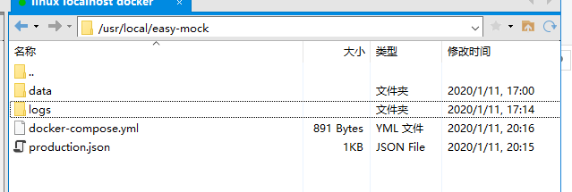

# 环境安装Docker版本

## 一、安装Docker

### 1.1安装步骤

1、Docker安装要求内核版本高于3.10，查看内核版本命令：

```
uname -r
```

2、使用 `root` 权限登录 Centos。确保 yum 包更新到最新。

```
$ sudo yum update
```

3、卸载旧版本(如果安装过旧版本的话)

```
$ sudo yum remove docker  docker-common docker-selinux docker-engine
```

4、安装需要的软件包， yum-util 提供yum-config-manager功能，另外两个是devicemapper驱动依赖的

```
$ sudo yum install -y yum-utils device-mapper-persistent-data lvm2
```

5、设置yum源

1) 安装wget

```
yum install -y wget
```

2) 备份/etc/yum.repos.d/CentOS-Base.repo文件

```
cd /etc/yum.repos.d/
mv CentOS-Base.repo CentOS-Base.repo.back
```

3) 下载阿里云的Centos-6.repo文件

```
wget -O CentOS-Base.repo http://mirrors.aliyun.com/repo/Centos-6.repo
```

4) 重新加载yum

```
yum clean all
yum makecache
```

6、查看所有docker版本

```
yum list docker-ce --showduplicates | sort -r
```

7、安装docker

```
sudo yum install docker-ce
```

8、启动、开机启动

```
sudo systemctl start docker
sudo systemctl enable docker
```

9、验证是否成功，如果包含client和service两个版本，表示安装成功

```
docker version
```

10、配置使用阿里云的镜像服务：

[http://dev.aliyun.com](http://dev.aliyun.com/)

进入阿里云开发者中心，选择控制台，找到镜像加速服务。

### 1.2常用docker命令

#### 1、查看所有容器 docker ps -a

#### 2、查看哪些容器在运行：docker ps

#### 3、查看宿主机上的docker 镜像docker images

#### 4、查看当前docker 信息 ：docker info

#### 5、启动、停止、重启镜像：docker  start/stop/restart container_name/container_id

#### 6、列出所有的镜像以及镜像的信息： docker image ls

#### 7、查看镜像、容器、数据卷所占用的空间：docker ststem df

#### 8、删除本地镜像： docker image rm container_id /container_name 

#### 9、查看日志：docker logs container_id /container_name 

#### 10、进入容器执行命令docker exec -it 38a2cae4c32f sh

#### 11、删除images：/docker rmi c8ae00a40d48

#### 12、修改容器自启动：docker update --restart=always

## 二、安装Mysql

#### 1.创建mysql

下载镜像：

```
docker pull centos/mysql-57-centos7
```

创建容器：

```
docker run -di --name=mysql --restart=always -p 3306:3306 -e MYSQL_ROOT_PASSWORD=123456 centos/mysql-57-centos7
```

## 三、创建redis

下载镜像：

```
docker pull redis
```

创建容器

```
docker run -di --name=redis --restart=always -p 6379:6379 -e requirepass=123456 redis
```

## 四、创建mongodb

下载镜像：

```
docker pull mongo
```

创建容器：

```
docker run -di --name=tensquare_mongo --restart=always -p 27017:27017 mongo
```

## 五、创建nexus仓库

下载镜像：

```
docker pull sonatype/nexus3
```

创建容器：

```
docker run -di --name nexus3 \
 --restart=always \
-p 8081:8081 \
-p 8082:8082  \
-p 8083:8083  \
-p 8084:8084  \
-p 8085:8085   \
-v /opt/nexus-data:/nexus-data \
sonatype/nexus3
```

错误处理：

```
mkdir: cannot create directory '../sonatype-work/nexus3/log': Permission denied
```

```
chown -R 200 /opt/nexus-data/
```

## 六、安装easy-mock

下载镜像

```
docker pull blackcater/easy-moc
```

创建容器

```
docker run -d -p 7300:7300 --link mongodb:mongodb -v /opt/mock-config/:/easy-mock/config --name easymock blackcater/easy-mock
```

## 七、安装docker-compose

```
curl -L https://get.daocloud.io/docker/compose/releases/download/1.22.0/docker-compose-`uname -s`-`uname -m` > /usr/local/bin/docker-compose
chmod +x /usr/local/bin/docker-compose
```

## 八、安装easy-mock

```
docker-compose up -d
```



## 九、安装gogs
下载镜像

```
docker pull gogs/gogs
```

创建存储目录

```csharp
mkdir -p /var/gogs
```

创建容器

```
docker run -di --name=gogs --restart=always -p 10022:22 -p 3000:3000 -v /var/gogs:/data gogs/gogs
```

重新安装时记得删除/var/gogs下文件，并赋予权限

http_port 改为3000 ，root_url改为dominIP:3080

## 十、安装GitLab

下载镜像

```
docker pull docker.io/gitlab/gitlab-ce
```

创建容器

```
docker run -d -h gitlab --restart=always -p 2222:22 -p 18001:80 -p 8443:443 -v /docker/gitlab/config:/etc/gitlab -v /docker/gitlab/logs:/var/log/gitlab -v /docker/gitlab/data:/var/opt/gitlab --restart always --name gitlab gitlab/gitlab-ce:latest

密码123456789
```

## 十一、安装内部邮件系统

拉取镜像

```
docker pull bestwu/ewomail
```

创建容器：

```
 docker run  -d -h mail.zdpx.com --restart=always   -p 17025:25   -p 109:109   -p 110:110   -p 143:143   -p 465:465   -p 587:587   -p 993:993   -p 995:995    -p 18002:80   -p 18003:8080   -v `pwd`/mysql/:/ewomail/mysql/data/   -v `pwd`/vmail/:/ewomail/mail/   -v `pwd`/ssl/certs/:/etc/ssl/certs/   -v `pwd`/ssl/private/:/etc/ssl/private/   -v `pwd`/rainloop:/ewomail/www/rainloop/data   -v `pwd`/ssl/dkim/:/ewomail/dkim/   --name ewomail bestwu/ewomailserver

```

默认管理用户名：admin ewomail123

## 十二、容器搭建DNS服务器

拉取镜像：

```
docker pull sameersbn/bind
```

创建容器：

```
docker run --name bind -d --restart=always --publish 53:53/tcp --publish 53:53/udp --publish 10000:10000/tcp --volume /srv/docker/bind:/data sameersbn/bind:latest
```

## 十三：搭建nginx服务器

拉取镜像

```
docker pull nginx
```

创建容器

```
docker run -d -p 80:80 --restart=always --name nginx nginx
```

拷贝配置：

```
docker cp -a nginx:/etc/nginx/ /docker/nginx/conf
```

停止并重启

```
docker stop nginx
docker rm nginx
```

重新运行挂载

```
docker run -p 80:80 --restart always --name nginx -v /docker/nginx/www:/www -v /docker/nginx/conf:/etc/nginx/ -v /docker/nginx/logs:/var/log/nginx -v /docker/nginx/wwwlogs:/wwwlogs -d nginx
```

重启

```
docker restart nginx
```

## 十四、关闭防火墙

```
systemctl stop firewalld.service #停止firewall
systemctl disable firewalld.service #禁止firewall开机启动
```

## 十五、创建私有仓库

拉取镜像

```
docker pull registry
```

创建容器

```
docker run -di --restart=always --name=registry -p 5000:5000 registry
```

## 十六、创建jenkins

拉取镜像

```
docker pull jenkins
```

创建容器

```
docker run -d -p 18005:8080 -v /docker/jenkins:/var/jenkins_home --name jenkins --restart=always jenkins
```

## 十七、安装tomcat

拉取镜像

```
docker pull tomcat
```

创建容器

```
docker run -d --restart=always -v /docker/tomcat:/usr/local/tomcat/webapps --name=tomcat -p 18006:8080 tomcat
```

## 十八、安装oracle

拉取镜像

```
docker pull registry.cn-hangzhou.aliyuncs.com/helowin/oracle_11g
```

创建容器

```
#启动启动容器
docker run -d -p 1521:1521 --name oracle11g registry.cn-hangzhou.aliyuncs.com/helowin/oracle_11g

docker start oracle11g

```

创建软链接

```
docker exec -it oracle11g bash
```

切换到root 用户下

```
su root

密码：helowin
```

编辑profile文件配置ORACLE环境变量

```
export ORACLE_HOME=/home/oracle/app/oracle/product/11.2.0/dbhome_2

export ORACLE_SID=helowin

export PATH=$ORACLE_HOME/bin:$PATH
```

创建软连接

​      ln -s $ORACLE_HOME/bin/sqlplus /usr/bin

切换到oracle 用户

​       这里还要说一下，一定要写中间的内条 -  必须要，否则软连接无效

```
su - oracle
```

登录修改密码：

```
sqlplus /nolog

conn /as sysdba

alter user system identified by system;

alter user sys identified by sys;

也可以创建用户  create user test identified by test;

并给用户赋予权限  grant connect,resource,dba to test;

alter database mount;

#刷新下表 
ALTER PROFILE DEFAULT LIMIT PASSWORD_LIFE_TIME UNLIMITED;
```

服务名：

helowinXDB

端口号1521

添加模式：

```
create user 用户名 identified by 口令[即密码];
```

