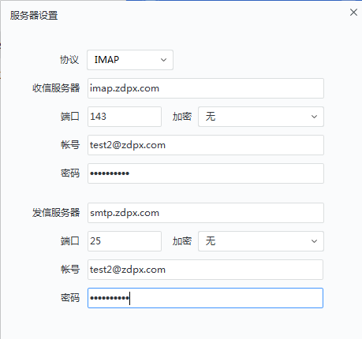

## 邮件系统使用说明

中电普信内部邮箱系统

登录地址：http://mail.zdpx.com/

管理地址：http://admin.mail.zdpx.com/

管理密码：admin ewomail123

## 网易邮箱大师使用步骤：

### 服务器配置

收信服务器:imap.zdpx.com  端口143 帐号：邮箱账号，密码：邮箱密码。

发信服务器：smtp.zdpx.com端口号：25 帐号：邮箱账号，密码：邮箱密码。